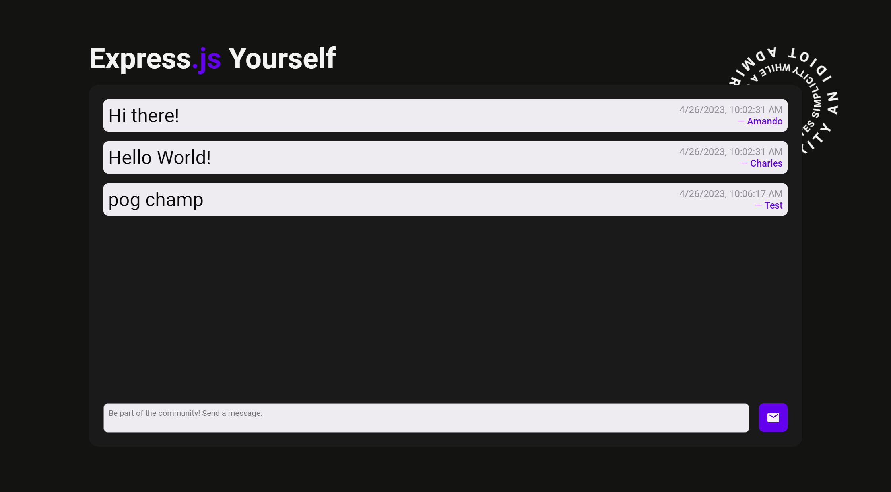

# odin-mini-message-board

A mini-message board built with Express.js and the EJS templating engine.

# Deploying on [Render.com](render.com)

Render was my chosen PaaS due to their free tier of 750 monthly hours that automatically shuts down after 15 minutes, allowing me to save on hosting costs for small projects.

## My Render.com Web Service Settings

Branch

- `main`

Root Directory

- `.`

Runtime

- Node

Build Command

- `npm install`

Start Command (after writing a start script inside `package.json`)

- `npm run start`

# Output

### [Visit the Website Here](https://odin-message-board-7ydx.onrender.com/)

# Reference

These were the requirements in The Odin Project's [Project: Mini Message Board](https://www.theodinproject.com/lessons/nodejs-mini-message-board) site in order to serve as a practice project for Express.js and server hosting provider deployment.
